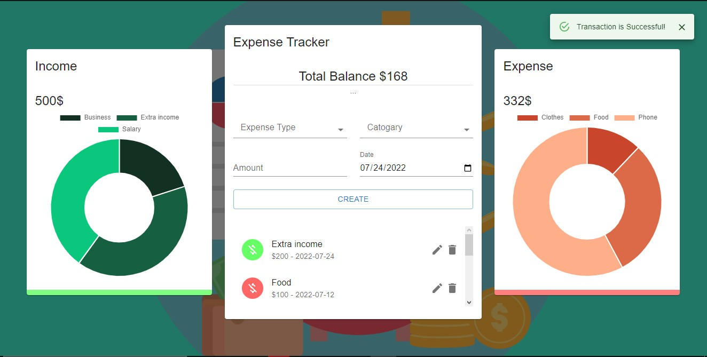

# Expense Tracker
I developed the higly attractive and an elegant Expense Tracker, using which you can keep track of your incomes and expenses. 
[Live Site](https://find-places-and-restruants.netlify.app)
 

## Developed with 
- React
- Material UI
- Charts
- Redux
- Local Storage

## Features:
- You can perform all the CRUD operations. Like Add, Remove and Edit the Entries.
- An efficient UI and visual representation of Expenses and Income.
- Fully Responsive

## How to Start
In the project directory, you can run:
### `npm start`

Runs the app in the development mode.\
Open [http://localhost:3000](http://localhost:3000) to view it in your browser.
